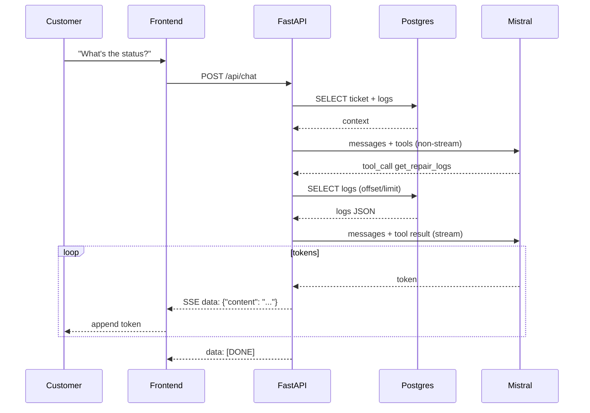

# Architecture Diagrams

## 1. High-Level System

```
┌─────────────────────┐       ┌─────────────────────┐
│  Technician Browser │       │  Customer Browser   │
│  (vanilla HTML/JS)  │       │  (vanilla HTML/JS)  │
└─────────┬───────────┘       └─────────┬───────────┘
          │ HTTPS                       │ HTTPS
          │ /api/login, /tickets, ...   │ /api/tickets/{id}/logs
          │                             │ /api/chat  (SSE)
          └──────────────┬──────────────┘
                         │
                ┌────────▼────────┐
                │    FastAPI      │
                │  (app/main.py)  │
                └────────┬────────┘
           ┌─────────────┼─────────────┐
           │             │             │
    ┌──────▼──────┐ ┌────▼────┐ ┌──────▼──────┐
    │  Auth +     │ │ Agent   │ │  Routes     │
    │  JWT/bcrypt │ │ (tool   │ │  (CRUD)     │
    │             │ │ calling)│ │             │
    └──────┬──────┘ └────┬────┘ └──────┬──────┘
           │             │             │
           └─────────────┼─────────────┘
                         │
                ┌────────▼────────┐
                │   PostgreSQL    │
                │   (Supabase)    │
                │ technicians     │
                │ tickets         │
                │ repair_logs     │
                └─────────────────┘
                         │
                ┌────────▼────────┐
                │  Mistral API    │
                │  (chat + tools) │
                └─────────────────┘
```

## 2. Chat Request Lifecycle (Happy Path)

```
Customer types message
        │
        ▼
Frontend POST /api/chat  {ticket_id, message, history}
        │
        ▼
chat.py → StreamingResponse(chat_stream(...))
        │
        ▼
agent.chat_stream
  1. Load verified context (ticket + recent logs)
  2. Build system prompt with <ticket_data>
  3. Call Mistral (non-stream) with tools
        │
        ├─ No tool_calls → stream the content directly
        │
        └─ Has tool_calls
              │
              ▼
           Execute get_repair_logs (forced to current ticket)
              │
              ▼
           Append tool result to messages
              │
              ▼
           Call Mistral again (stream=True)
              │
              ▼
           Yield SSE tokens → Frontend appends to chat UI
```

## 3. Data Model (simplified)

```
technicians
  id ─────┐
  email   │
  name    │
  password_hash
          │
          │ 1:N
          ▼
tickets
  id ─────┐
  customer_name
  device_info
  status          (pending | in_progress | waiting_parts | completed)
  technician_id ──┘
  created_at
          │
          │ 1:N
          ▼
repair_logs
  id
  ticket_id
  technician_id
  note
  created_at
```

## 4. Mermaid (copy into any Mermaid renderer)



---

Keep this file open while reading the walkthroughs.
